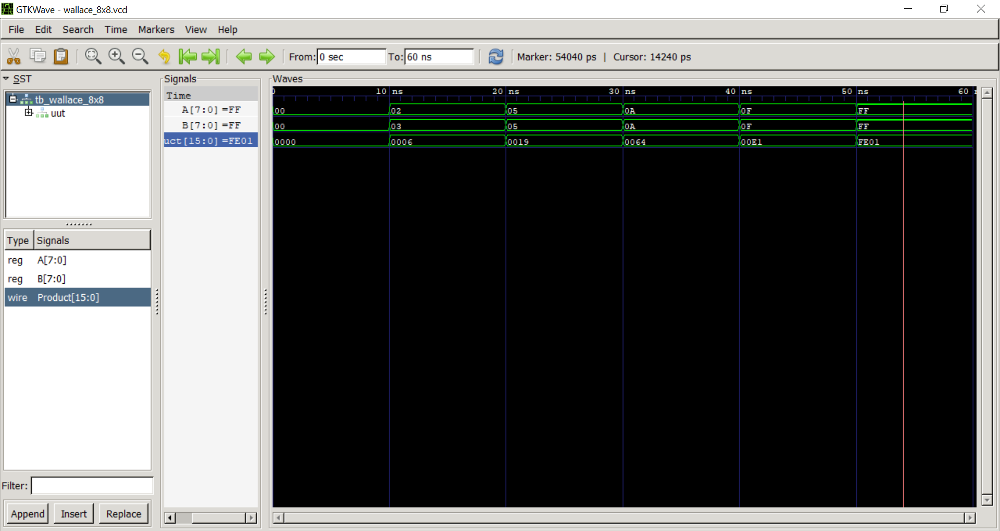
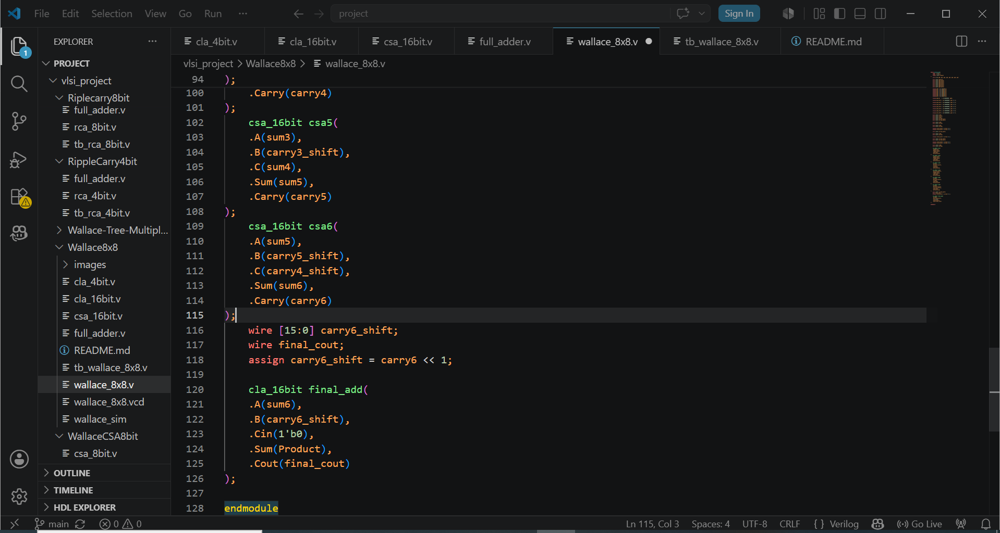
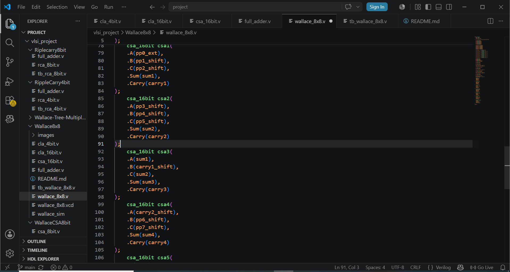
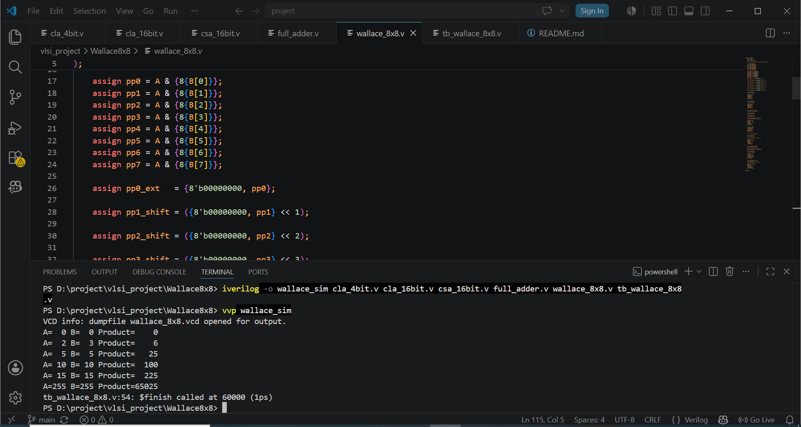

# 8×8 Wallace Multiplier using Verilog HDL

## Overview

This project implements an **8×8 Wallace Multiplier** in Verilog HDL. The design generates partial products from two 8-bit operands and reduces them using multiple **Carry Save Adder (CSA)** stages, followed by a **Carry Lookahead Adder (CLA)** for final addition.

The Wallace Tree architecture improves multiplication efficiency by reducing partial products in parallel, making it faster than conventional multiplier implementations.

---

## Design Specifications

| Parameter | Value |
|------------|------------|
| Multiplier Type | Wallace Tree Multiplier |
| Input Width | 8-bit |
| Output Width | 16-bit |
| Reduction Method | Carry Save Adders (CSA) |
| Final Adder | Carry Lookahead Adder (CLA) |
| HDL | Verilog |
| Verification | Testbench Simulation |

---

## Architecture

### Partial Product Generation

Eight partial products are generated using bitwise AND operations:

```verilog
pp0 = A & {8{B[0]}};
pp1 = A & {8{B[1]}};
...
pp7 = A & {8{B[7]}};
```

Each partial product is appropriately shifted according to its bit position.

### Wallace Tree Reduction

The shifted partial products are reduced using multiple **16-bit Carry Save Adders (CSA)**.

Reduction Flow:

```text
8 Partial Products
        ↓
      CSA Stage 1
        ↓
      CSA Stage 2
        ↓
      CSA Stage 3
        ↓
      CSA Stage 4
        ↓
   Carry Lookahead Adder
        ↓
      Product
```

### Final Addition

The final two operands are added using a **16-bit Carry Lookahead Adder (CLA)** to generate the 16-bit product.

---

## Project Files

```text
full_adder.v        → 1-bit Full Adder
cla_4bit.v          → 4-bit Carry Lookahead Adder
cla_16bit.v         → 16-bit Carry Lookahead Adder
csa_16bit.v         → 16-bit Carry Save Adder
wallace_8x8.v       → Top-Level Wallace Multiplier
tb_wallace_8x8.v    → Testbench
```

---

## Functional Verification

The design was verified using simulation in **Icarus Verilog** and waveform analysis in **GTKWave**.

### Test Cases

| A | B | Expected Product |
|----|----|----|
| 0 | 0 | 0 |
| 2 | 3 | 6 |
| 5 | 5 | 25 |
| 10 | 10 | 100 |
| 15 | 15 | 225 |
| 255 | 255 | 65025 |

### Simulation Result

All test cases passed successfully.

---

## Tools Used

- Verilog HDL
- Icarus Verilog
- GTKWave
- Visual Studio Code

---

## Skills Demonstrated

- Digital Logic Design
- Verilog RTL Design
- Carry Save Adder Architecture
- Carry Lookahead Adder Design
- Wallace Tree Multiplication
- Functional Verification
- Waveform Analysis
- FPGA/ASIC Design Fundamentals

---

## Results

### Waveform Verification



### Simulation Output



### Wallace Tree Reduction Stages

#### CSA Reduction Stage 1



#### CSA Reduction Stage 2 and Final CLA



## Future Improvements

- 16×16 Wallace Multiplier
- Pipelined Wallace Multiplier
- Parameterized Verilog Design
- RTL Synthesis and Timing Analysis
- ASIC Physical Design Flow Integration

---

## Author

**Faraaz Shaikh**

B.Tech Electronics Engineering (VLSI Design & Technology)

CSMSS Chh. Shahu College of Engineering, Chhatrapati Sambhajinagar

---

## License

This project is intended for educational and learning purposes.